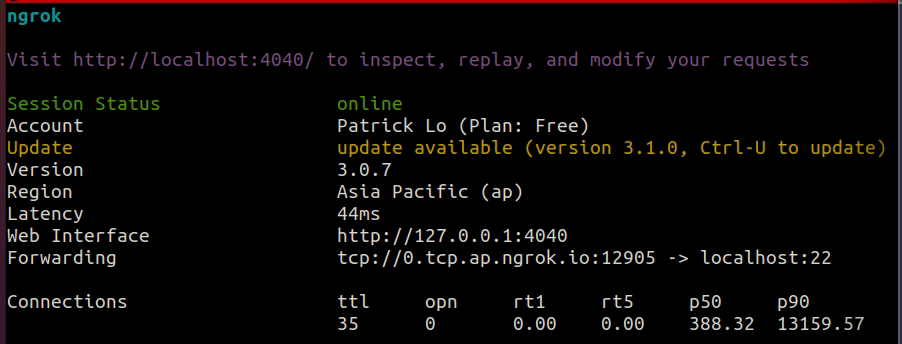

# Tools for Remote Session

## Ngrok
- Ngrok is a software to provide internet and server connectivity via third-party service. It provides a variety of functionality, yet I solely use it to ssh my machine from my laptop without penetrating local network.
  
1. Installation
   ```
   curl -s https://ngrok-agent.s3.amazonaws.com/ngrok.asc | sudo tee /etc/apt/trusted.gpg.d/ngrok.asc >/dev/null && echo "deb https://ngrok-agent.s3.amazonaws.com buster main" | sudo tee /etc/apt/sources.list.d/ngrok.list && sudo apt update && sudo apt install ngrok
   ```
2. Remember to sign up to acquire a token
   ```
   ngrok config add-authtoken <token>
   ```
3. The free version is actually sufficient, from my perspective.
4. After all the installation. Setup a shell script
   ```
   nano ngrok.sh

   cd /usr/local/bin
   ./ngrok tcp 22 # for ssh purpose
   # ctrl + s, ctrl + x

   chmod +x ngrok.sh
   ./ngrok.sh
   ```

5. Terminal should be showing some information as shown below
   
   
   
6. Take the above as instance, on your remote machine, fire up terminal, and input
   ```
   ssh patty@0.tcp.ap.ngrok.io -p12905 
   ```
   You can even send message using ssh with ngrok as follows:
   ```
   sudo scp -P {port_number} {file_name} {username}@0.tcp.jp.ngrok.io:{directory_localtion}

   # if you want to send a folder, can do the following first
   zip -r {filename}.zip {filename}
   ```
7. Input your passcode, and voila! You are now able to code anywhere!

## Anydesk
1. Visit [here](https://anydesk.com/en), and select the version that corresponds to your machine.
2. Should be easy to install, but for further convenience, remember to setup unattended access in settings, so that you could connect to your machine with your personal passcode at ease

